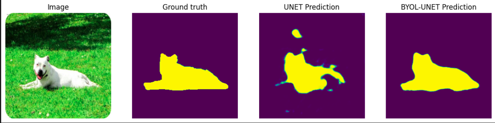
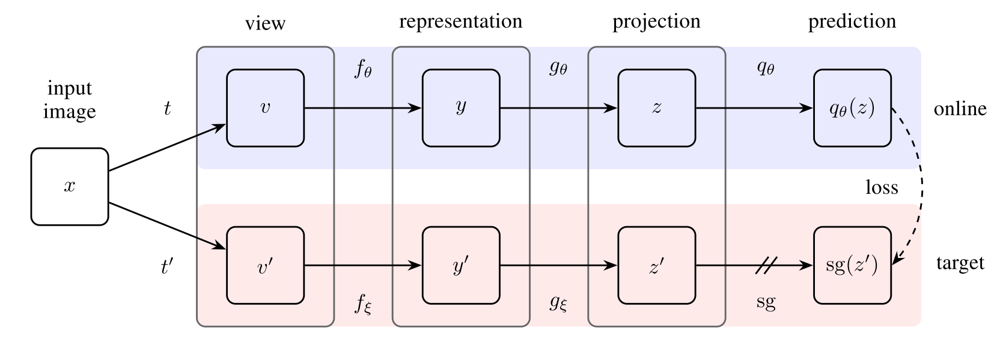

# byol

This is a Pytorch implementation of BYOL for improving downstream performance of several computer vision tasks.

byol allows your models to learn useful representations without relying on labeled data, which is particularly difficult to obtain for a lot of vision tasks. It is particuarly useful on pipelines of pre-training and fine-tuning, where a pre-training is applied on a large unlabelled dataset, and then, downstream, fine-tuned on a smaller labelled dataset.

## Examples

Some examples and explanations of the BYOL's functionality for tuning tasks can be found on the `examples` directory.



## Usage

Use  `BYOLTransforms` from `byol.utils` to apply transforms to your dataset.
```python
from byol.utils import BYOLTransforms, BYOLTransforms1

transform = BYOLTransforms(
    view1=BYOLTransforms1(input_size=32), # the input_size depends on your data
    view2=BYOLTransforms1(input_size=32)
)

# Example with CIFAR10
import torchvision

cifar10 = torchvision.datasets.CIFAR10(root='./data', train=True, download=True, transform=transform)
```

Use `BYOL` from `byol.models` to create a BYOL module. All modules are Pytorch Lightning modules, so you may use `pl.Trainer` to train/test/predict if you want. 

Some example models are also given, such as a ResNet18 classification model and a U-Net model with ResNet encoders for semantic segmentation.

```python
from byol.models import BYOL, ResNetModule

resnet_module = ResNetModule()
max_epochs = 5

byol_module = BYOL(
    hparams={
        "input_dim": 512,
        "hidden_dim": 1024,
        "projection_dim": 256,
        "max_epochs": max_epochs, # used for the cosine scheduler
    },
    model=resnet_module.model
)

byol_trainer = pl.Trainer(
    max_epochs=max_epochs,
    devices=1,
    accelerator=accelerator,
)

byol_trainer.fit(model=byol_module, train_dataloaders=byol_dataloader)

# After training, you can then load the state_dict with the feature-rich weights and continue to fine-tuning

resnet_module.model.load_state_dict(byol_module.backbone.state_dict())

resnet_trainer = pl.Trainer(...
```

## BYOL (Bootstrap Your Own Latent) - Self-Supervised Image Representation Learning

BYOL is a self-supervised approach to image representation learning. It relies on two neural networks, referred to as the online and target networks, that interact and learn from each other. The goal is to train the online network to predict the target network representation of an augmented view of an image. Simultaneously, the target network is updated with a slow-moving average of the online network.



## Resources

- [BYOL Paper](https://arxiv.org/abs/2006.07733): The original research paper describing the BYOL approach.
- [lightly](https://github.com/lightly-ai/lightly): A computer vision framework for self-supervised learning, which can be used to implement BYOL and other self-supervised learning methods.


